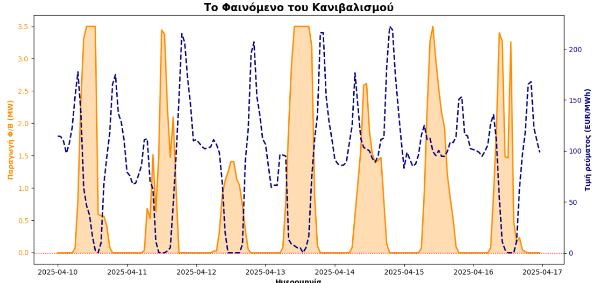

# 🔋 BESS Optimization & Energy Arbitrage using Python

## 📌 Project Overview
This repository contains a mathematical optimization and data analysis study focusing on the **Renewable Cannibalization Effect** and the financial viability of Battery Energy Storage Systems (BESS). 

Using real hourly Day-Ahead Market (DAM) prices from ENTSO-E (Greece) and simulated energy production from a **5 MWp Solar PV plant**, this project develops algorithms to optimally dispatch a **3.84 MWh BESS**, maximizing annual revenue under a strict 3.50 MW grid export limit.

> **Note:** The generation data (8760 hours) used in this optimization was generated via a detailed PVsyst simulation from a previous project. You can view the PVsyst design phase [here](https://github.com/konstantinosxir/PVsyst-5MWp-Solar-BESS-Study).

## ⚙️ Algorithms Developed

To manage the charging/discharging cycles, three distinct strategies were modeled and compared:

1. **Static Threshold:** Charges when prices drop below 40 €/MWh and discharges when prices exceed 120 €/MWh.
2. **Smart Daily Heuristic (Dynamic):** Adapts daily to the DAM curve, finding the exact 2 cheapest hours to charge and 2 most expensive hours to discharge.
3. **Linear Programming (LP) via PuLP:** Formulates the arbitrage strategy as a strict mathematical optimization problem (Simplex algorithm), solving for the absolute theoretical maximum profit considering SoC constraints, green charging rules and grid limitations.

## 📊 Financial Results & Impact

The integration of the BESS and the application of optimization algorithms yielded significant revenue increases compared to a standalone PV plant:

| Strategy | Description | Annual Revenue (€) | Added Value vs Base (€) |
| :--- | :--- | :--- | :--- |
| **1. Base Case (No BESS)** | Direct grid export (capped at 3.5 MW) | 453,580 | - |
| **2. Static Heuristic** | Fixed 40€ / 120€ thresholds | 547,111 | + 93,531 |
| **3. Dynamic Heuristic** | Smart daily peak shaving | 615,960 | + 162,380 |
| **4. Linear Optimization** | **Absolute Mathematical Maximum** | **659,666** | **+ 206,086** |

**Key Takeaways:**
* The BESS installation increases annual revenue by up to **+45.4%**.
* Utilizing strict **Mathematical Optimization (LP)** generated an additional **+43,706 €** over the smart heuristic model, proving the necessity of advanced Data Analytics in modern energy trading.

## 📈 Visualizing Cannibalization
During sunny spring days, the simultaneous overproduction of solar energy crashes the grid price to zero, while evening prices spike. The developed LP model shifts the PV generation to perfectly capture these evening peaks.

  

## 🛠️ Tech Stack
* **Language:** Python
* **Data Manipulation:** `pandas`, `numpy`
* **Mathematical Optimization:** `pulp` (Simplex Solver)
* **Visualization:** `matplotlib`
* **Documentation:** LaTeX - *The full analytical report can be found in the `docs/BESS_programming.pdf` file.*

## 👨‍💻 Author
**Konstantinos Xirogiannis** 
* Electrical & Computer Engineering, NTUA
* Connect with me on [LinkedIn](https://www.linkedin.com/in/konstantinosxirogiannis/)
